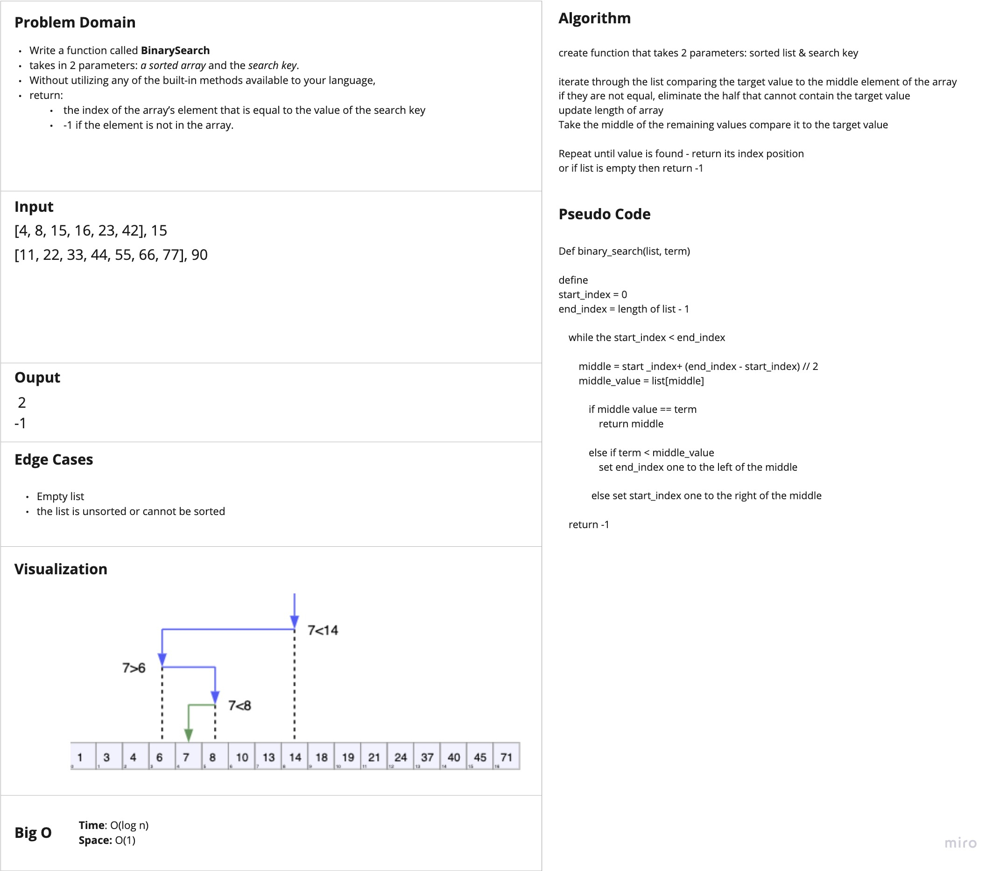

# Binary Search of Sorted Array

Write a function called `BinarySearch` which takes in 2 parameters: a sorted array and the search key

-   return:
    -   the index of the array’s element that is equal to the value of the search key
    -   or -1 if the element is not in the array

## Whiteboard Process

## Approach & Efficiency

**Big O**

-   Time: O(log n)
-   Space: O(1)

Sources:

[Binary Search Algorithm Explained](https://www.youtube.com/watch?v=DnvWAd-RGhk)

[Wikipedia: Binary Search Alorithm](https://en.wikipedia.org/wiki/Binary_search_algorithm)
