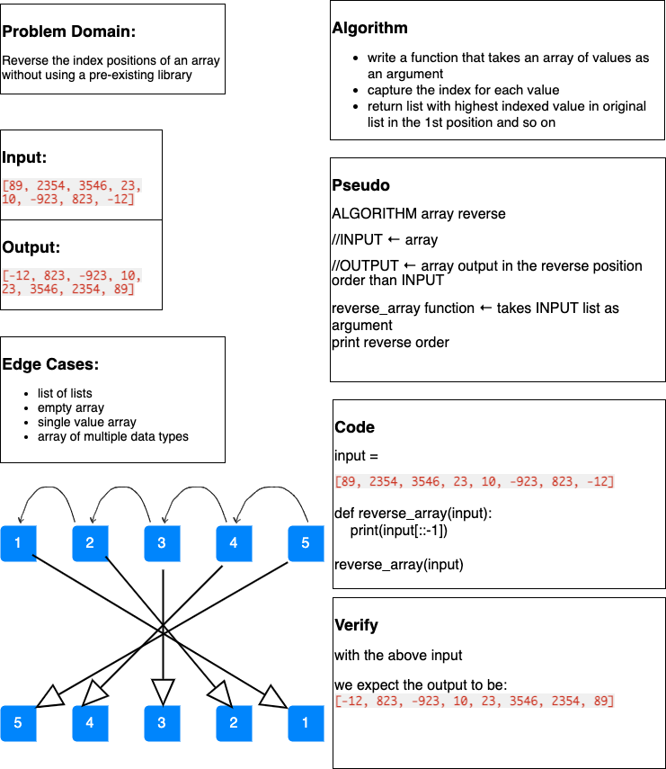

# Array Reverse

\*Author: Matthew Santorsola

---

## Problem Domain

Write a function called `reverseArray` which takes an array as an argument. Without utilizing any of the built-in methods available to your language, return an array with elements in reversed order.

---

## Inputs and Expected Outputs

| Input           | Expected Output |
| :-------------- | :-------------- |
| [1, 2, 3, 4, 5] | [5, 4, 3, 2, 1] |

---

## Big O

| Time | Space |
| :--- | :---- |
| O(n) | O(1)  |

---

## Whiteboard Visual

**array reverse**

---

## Change Log

**_[The change log will list any changes made to the code base. This includes any changes from TA/Instructor feedback]_**

1.0: _Initial submission_ - 07 Jun 21

---

For more information on Markdown: https://www.markdownguide.org/cheat-sheet
