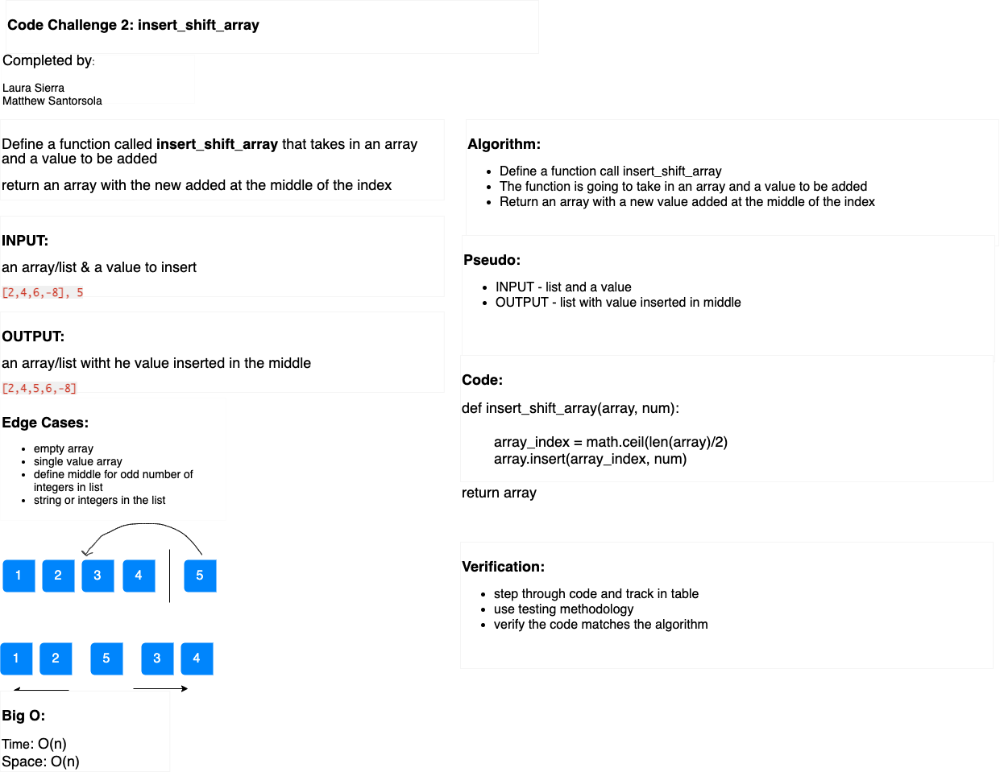

# Insert to Middle of an Array

Write a function called `insertShiftArray` which takes in an array and the value to be added. Return an array with the new value added at the middle index.

## Whiteboard Process

## Approach & Efficiency

array_index = math.ceil(len(array)/2)
array.insert(array_index, num)

-   Find the length of the array
-   divide by two
-   round up to next integer (to shift to right for odd length lists)
-   insert this value into the index argument in `insert` for the place to to put the number into the list

[insert](https://www.geeksforgeeks.org/python-list-insert/)

[round-up](https://www.w3schools.com/python/ref_math_ceil.asp)
