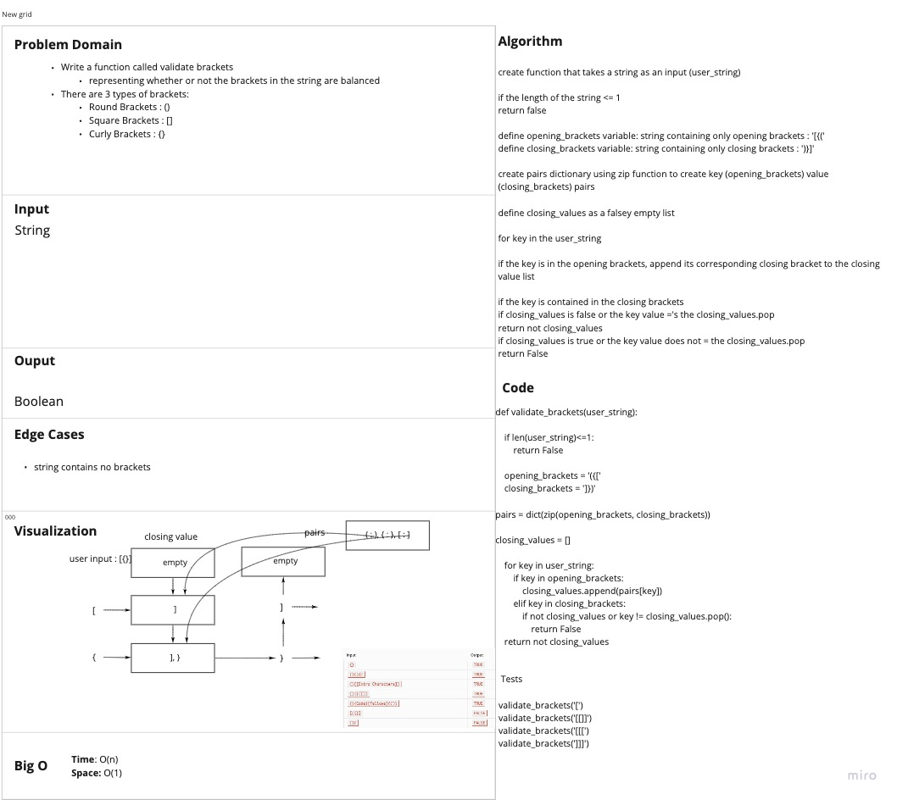

# Challenge Summary

write a function called `validate-brackets`
takes a string as an argument
returns boolean

There are 3 types of brackets:

Round Brackets : `()`
Square Brackets : `[]`
Curly Brackets : `{}`

## Whiteboard Process

